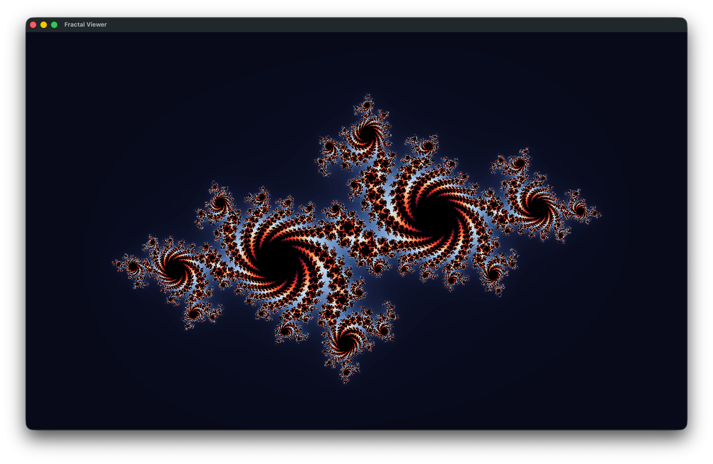
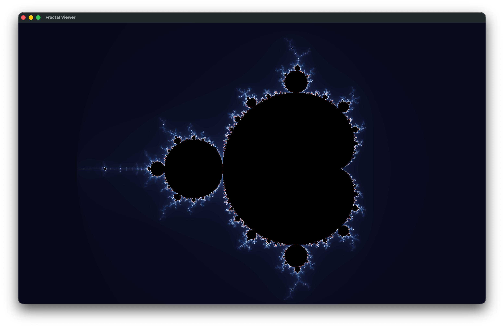

# Fractal viewer

A C++ implementation to calculate and visualize the Mandelbrot and Julia sets, developed as a student project.

## Project Overview
This project provides a straightforward way to compute the Mandelbrot & Julia sets. The focus was on implementing the mathematical logic behind fractal generation, handling complex numbers, and ensuring a clean code structure.

## Technical Details
*   **Language:** C++
*   **Approach:** Implements the classic [escape-time algorithm](https://en.wikipedia.org/wiki/Plotting_algorithms_for_the_Mandelbrot_set).
* Implemented using [SFML project template.](https://github.com/SFML/cmake-sfml-project)

## Getting Started

### Prerequisites
*   **C++ Compiler**
*   **CMake**

### Building the Project
1. Clone the repository:
```bash
git clone https://github.com/farnam-jhn/MandelbrotExplorer.git
cd MandelbrotExplorer
```
> Note : on linux machines you need `MbedTLS`
> 
On Debian based distros:
```bash
sudo apt install libmbedtls-dev
```
Arch based:
```bash
sudo pacman -S mbedtls
```
RHEL based:
```bash
sudo dnf install mbedtls-devel
```

> Note : on macOS you can install sfml using brew

```bash
brew install sfml
```

2. Create a build directory and compile:
```bash
mkdir build
cd build
cmake ..
cmake --build .
```
3. Start the application:
```bash
cd bin
./fracv
```
> Note: On windows use `.\fracv.exe`

### Usage

to change computed fractal you can give the program arguments:
```bash
./fracv julia 0.112 0.1231
```
this generates julia set with starting constant of: `0.112 + 0.1231i`
or:
```bash
./fracv mandelbrot
```
if no argument is given program generates mandelbrot as default value.

#### Zoom functionality
there is a zoom functionality  
to use it you just drag click your mouse on the screen.
## Other docs
See [Documents folder](docs) for more details on the project.

## Screenshots


