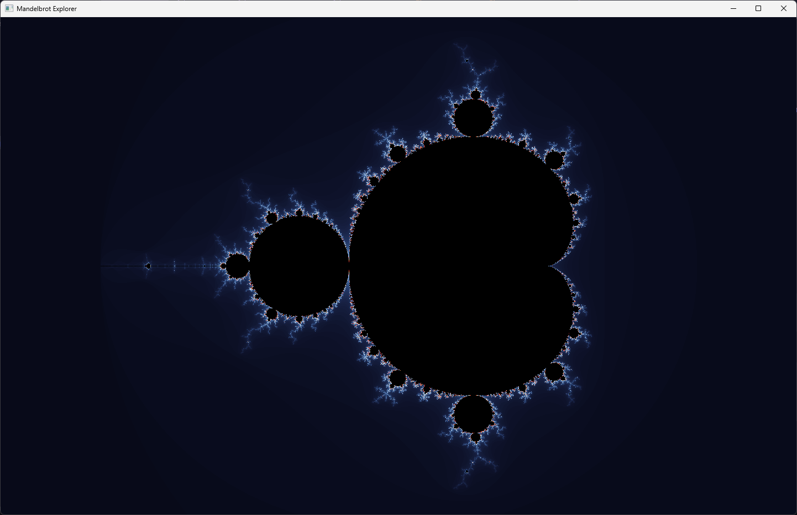
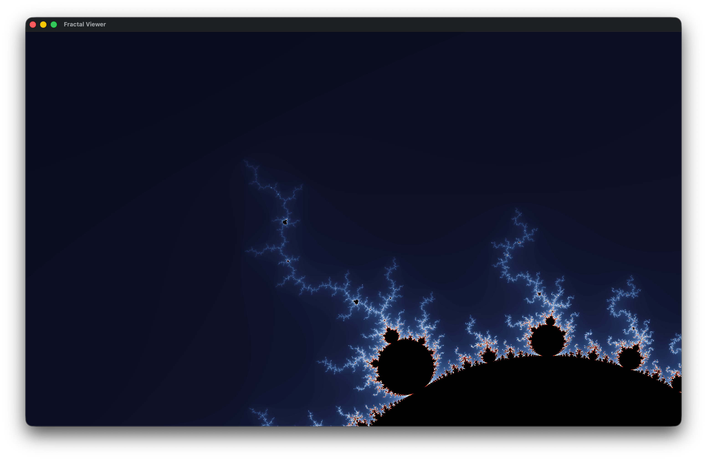
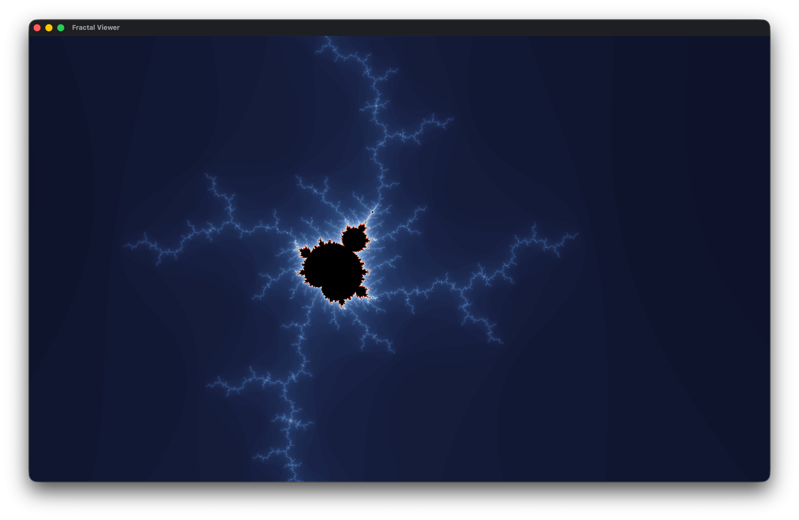
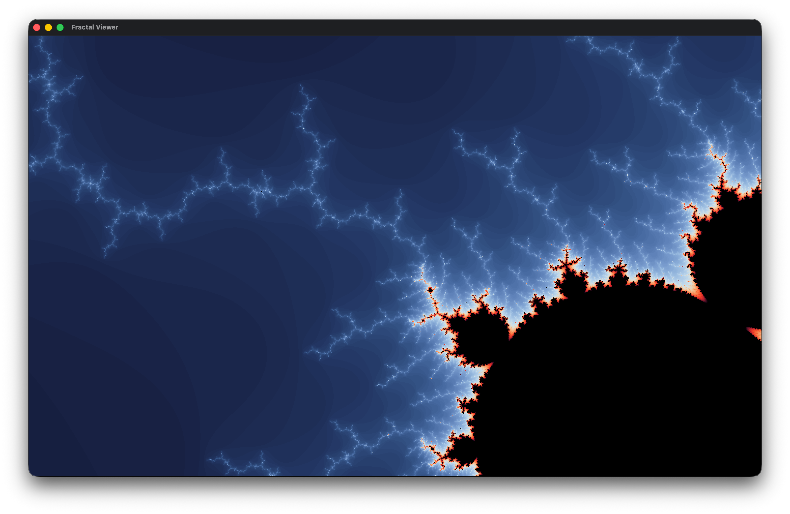

### V1 :

#### Description
there is no coloring in this version and this is just a simple calculation of the set using escape-time algorithm

### V2 :

#### Description
in this version i used a color palette + lerp to color it.

### V3 :

#### Description
there's nothing new visually, i implemented multi-threading
however the image looks different because i changed max iterations count. 
### V4 :

#### Description
Modeld julia set, added an interface for fractals.
practically nothing new.

### V5 :
 

#### Description
Added zoom functionality and optimized the program by changing compile flags